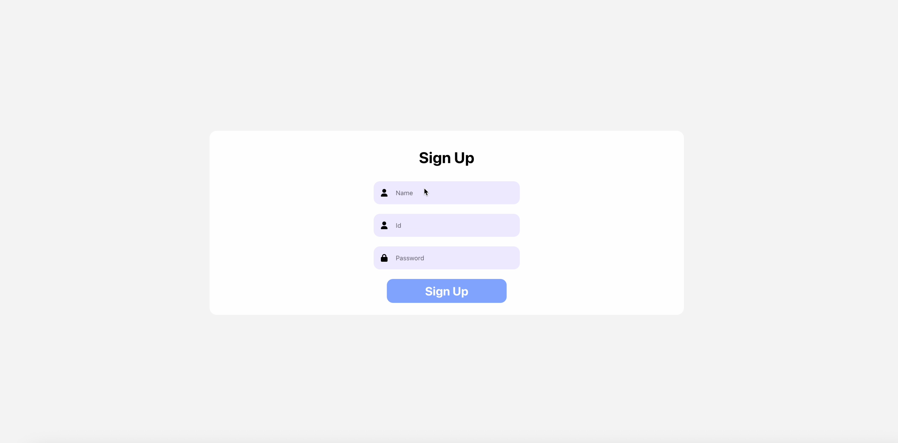
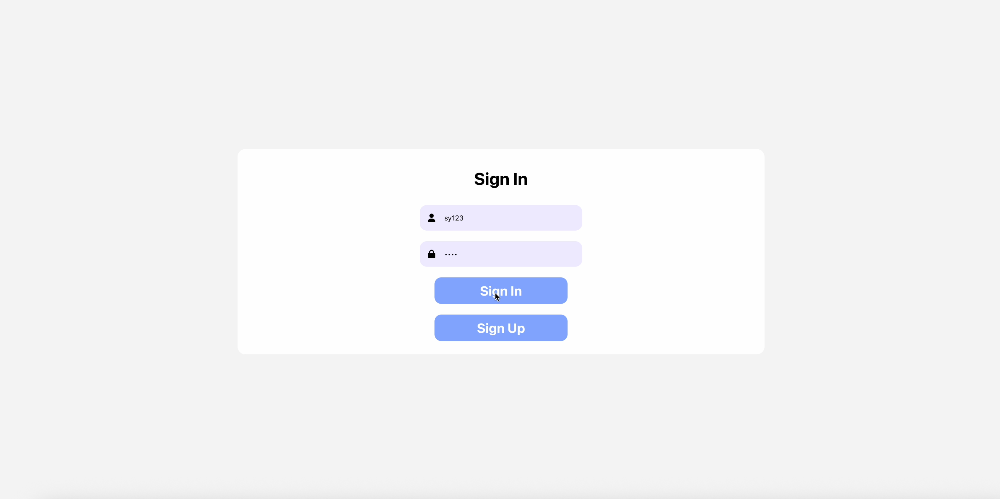
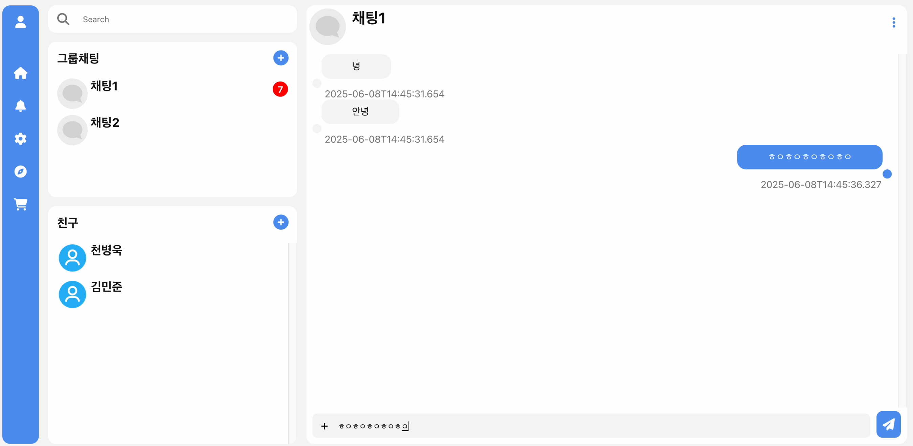
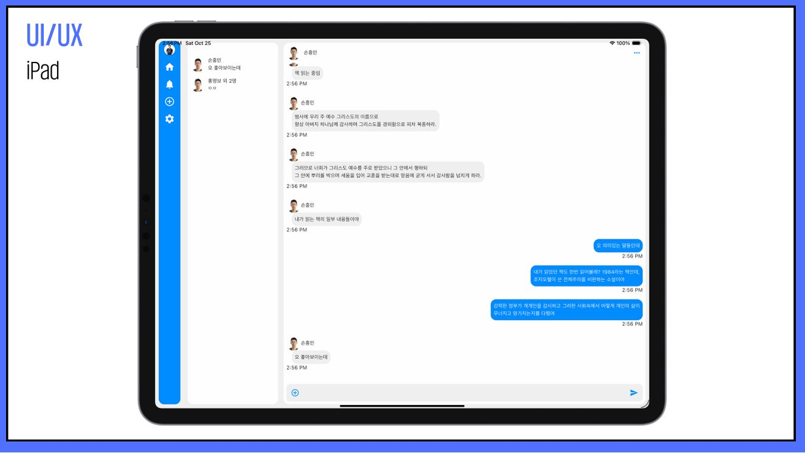
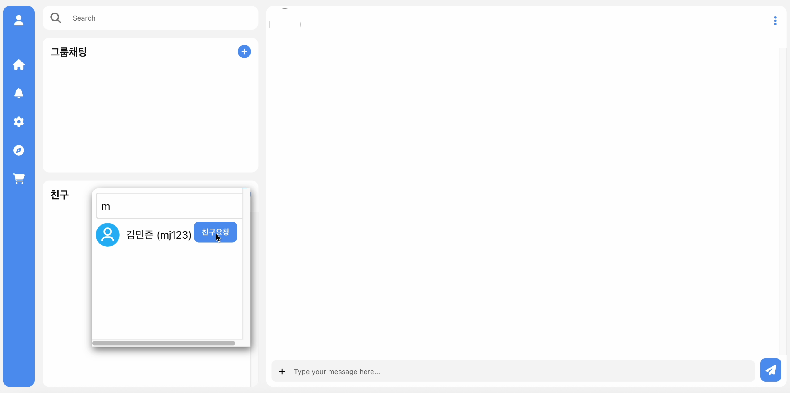
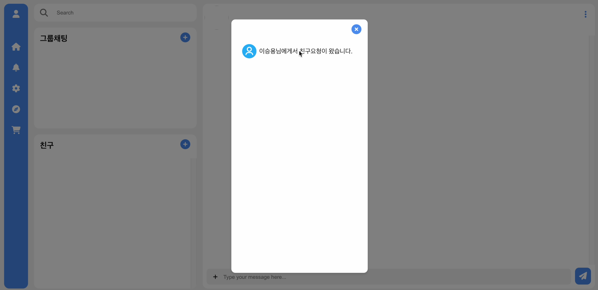
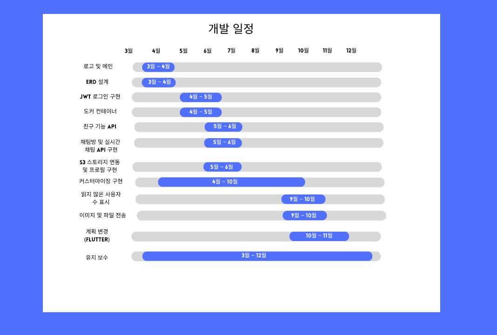
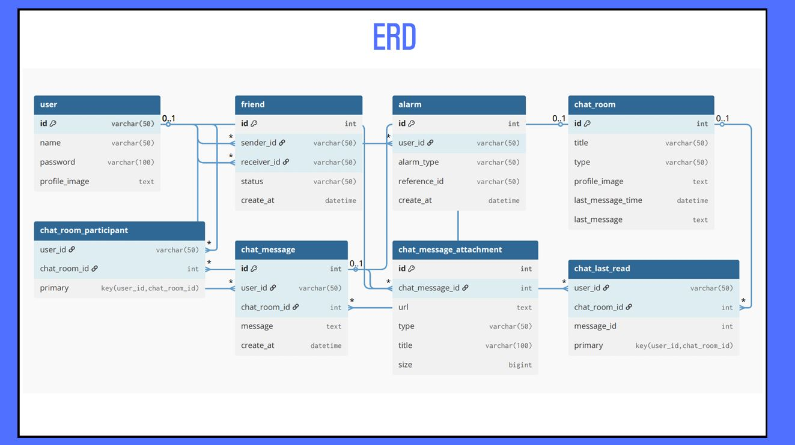
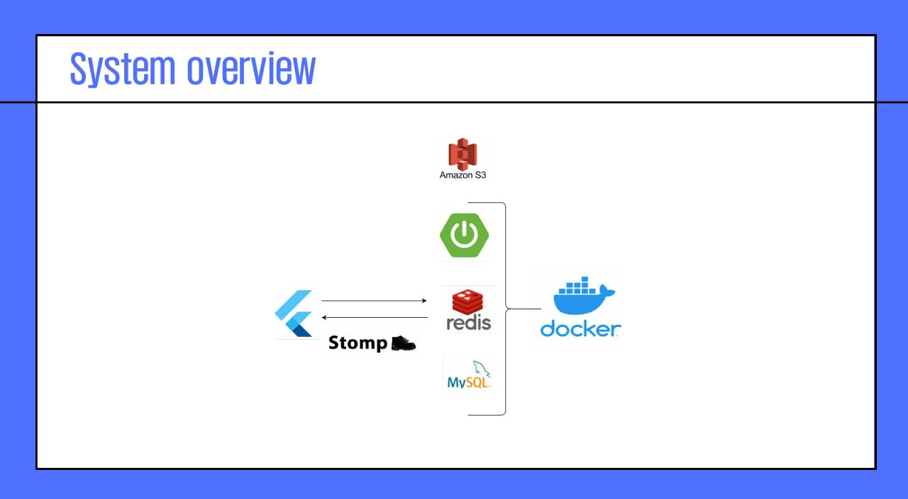

# TIKITAKA

## 소스

- [프론트엔드](https://github.com/siar1234/tikitaka-front)
- [백엔드](https://github.com/minjun1015/tikitaka-back-end)
- [계획변경 이전 프론트엔드](https://github.com/siar1234/tikitaka-front-old)

## 개요

## 시연동영상

https://youtu.be/W-Ti9mE6iMY

## 주요기능

### 회원가입 및 로그인

### 실시간 채팅

### 친구추가 및 실시간 알림

## 개발일정

## ERD

## 시스템 아키텍쳐

## 개발자목록

|             |                    |                  |
|---------------------------------------|------------------------------------|----------------------------------|
| [김민준](https://github.com/minjoon1015) | [이승용](https://github.com/siar1234) | [천병욱](https://github.com/chbyuk) |