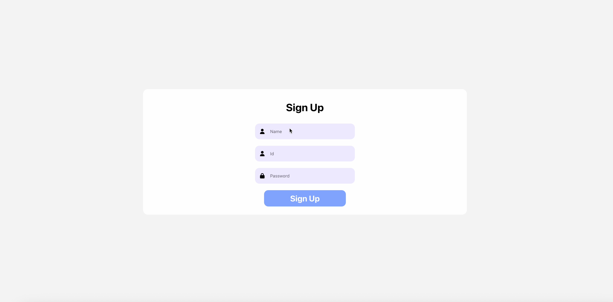
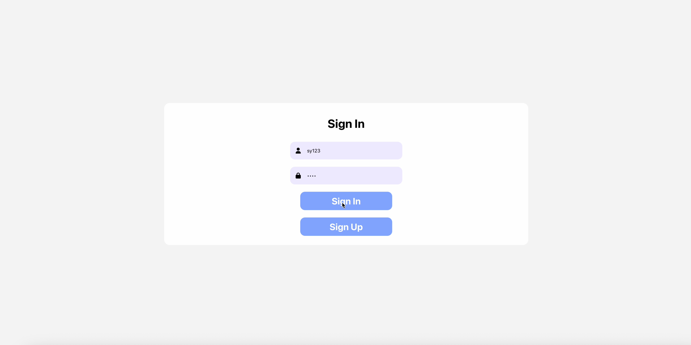
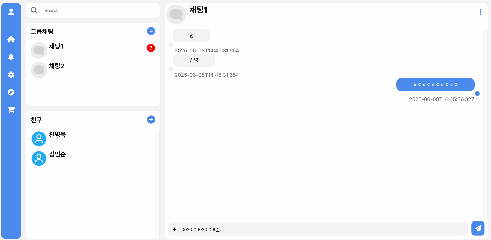
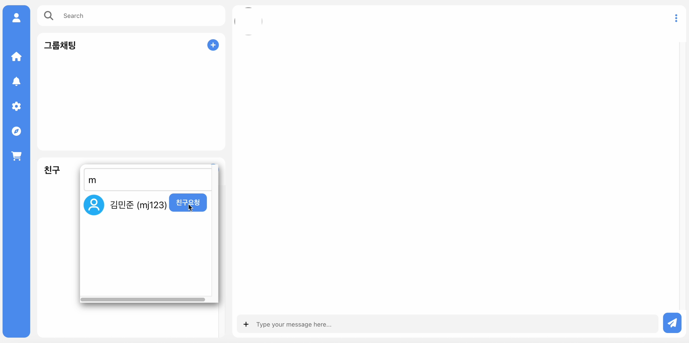
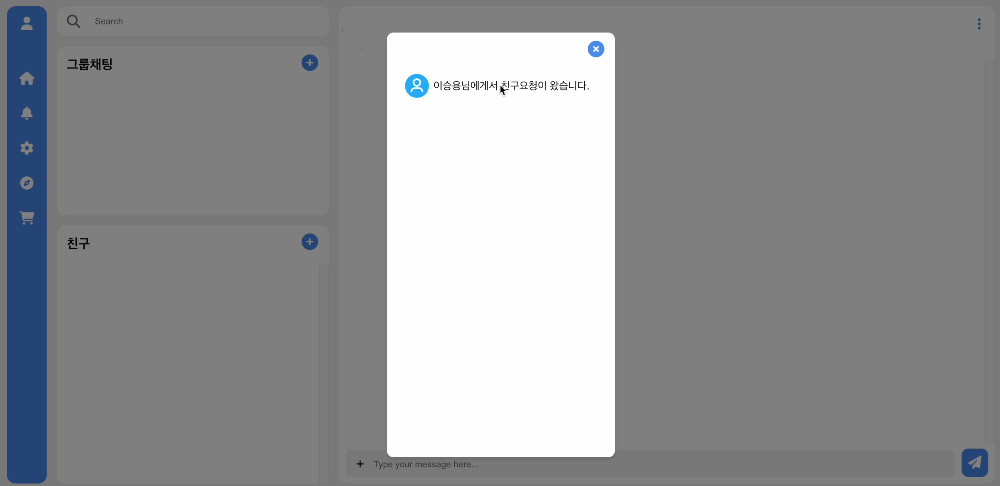
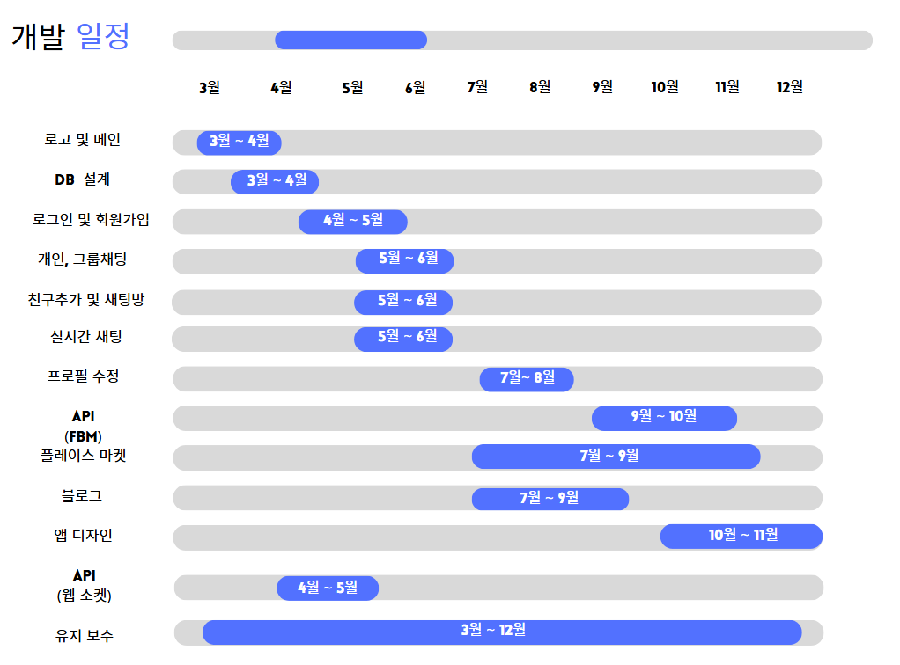
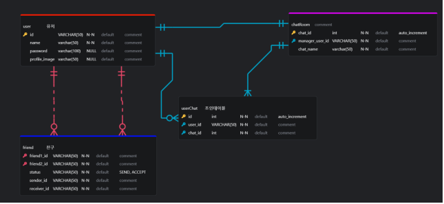

# TIKITAKA

## 소스

- 프론트엔드 - https://github.com/siar1234/tikitaka-front
- 백엔드 - https://github.com/minjun1015/tikitaka-back

## 개요

**사용자가 지정한 테마로 UI를 완전히 커스터마이징할 수 있는 채팅 서비스**

## 시연동영상

https://youtu.be/GJ47xWy5QIw

## 주요기능

### 회원가입 및 로그인

### 실시간 채팅

### 친구추가 및 실시간 알림

### 커스텀 테마 적용

## 개발일정

## ERD

## 개발환경 및 도구

| IDE & 코드에디터                                                               | 라이브러리 및 프레임워크                       | 데이터베이스                                          |
|---------------------------------------------------------------------------|-------------------------------------|-------------------------------------------------|
|                            |      |  |
| |     |  |

## 개발자목록

| 김민준 | 이승용                                   | 천병욱                               |
| ------ | ---------------------------------------- |-----------------------------------|
|[minjoon1015](https://github.com/minjoon1015)| [Siar](https://github.com/siar1234) | [chbyuk](https://github.com/chbyuk) |
